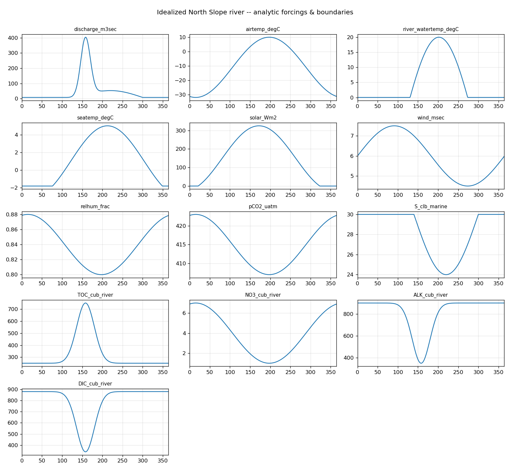

# NS-RAD — North Slope River-Aquatic-Delta Model

A **C-GEM-based 1-D reactive-transport model** of the four main Alaskan North Slope
rivers — **Colville, Kuparuk, Sagavanirktok, Canning** — from Brooks Range headwaters to
the Beaufort Sea. NS-RAD couples hydrodynamics, transport, carbonate chemistry, air–sea
gas exchange (CO₂/CH₄/N₂O), a transported temperature field with a surface heat budget, a
prognostic river-ice model, and an optional Arctic biogeochemistry extension.

Built on **C-GEM** (Volta et al. 2014, *Geosci. Model Dev.*), the underlying estuarine
reactive-transport engine; NS-RAD is the North-Slope configuration and the science built
on top of it.



## What it does

- **Four rivers, observation-based** — channel geometry from SWORD v17c widths + USGS ADCP
  depth surveys; discharge from USGS gauges; a river-appropriate dispersion closure
  (Seo & Cheong 1998) replacing the tide-estuary Savenije form.
- **Carbonate system + air–sea CO₂** — Follows et al. (2006) / Millero (1995) carbonate
  solve → pH and FCO₂ (sign convention: FCO₂ > 0 is outgassing).
- **Transported temperature + surface heat budget** — interior temperature is
  atmospherically forced, not a boundary mixing tracer.
- **Prognostic river ice** — freeze-up, Stefan growth, surface melt, and **hydraulic**
  (freshet) break-up; couples to gas exchange, under-ice light, and biogeochemistry.
- **Arctic biogeochemistry extension** *(opt-in)* — refractory/chromophoric DOC + CDOM
  photomineralisation, CH₄ and N₂O cycling, benthic (SOD) DIC/alkalinity efflux, and
  distributed lateral loading. See [`docs/arctic_biogeochemistry.md`](docs/arctic_biogeochemistry.md).
- **Idealized verification fixture** — a synthetic river with analytic, time-varying
  forcing/boundaries and a physical-invariant test harness. See
  [`docs/idealized_verification.md`](docs/idealized_verification.md).

## Requirements

Python 3.13 (conda/miniforge), with `numpy`, `numba` (JIT — load-bearing), `netCDF4`,
`matplotlib`; `ffmpeg` for movies; `python-docx` only to rebuild the Word guide.

```bash
conda install numba netcdf4 matplotlib ffmpeg
```

## Quick start

One command runs all four rivers, then rebuilds every figure PDF and movie:

```bash
tools/build_all.sh                    # run 4 rivers + all figures  (~15 min run + figures)
tools/build_all.sh --figures-only     # rebuild figures from existing runs
tools/build_all.sh --with-idealized   # also run + verify + figure the idealized fixture
```

Run a single river, or a fast smoke test:

```bash
tools/run_sites.sh kuparuk                                   # one river -> runs/definitive/kuparuk/
CGEM_MAXT_DAYS=2 CGEM_WARMUP_DAYS=1 tools/run_sites.sh       # 2-day smoke test, all four
```

Verify the model on the idealized fixture (exits non-zero on any failure):

```bash
python tools/verify_idealized.py --check-only   # structural, no run
python tools/verify_idealized.py                # + short run
python tools/verify_idealized.py --full         # + full seasonal run (all extensions)
```

## Repository layout

| path | contents |
|---|---|
| `code/` | the model — hydrodynamics, transport, carbonate, heat, ice, biogeochemistry, `sites/<river>.py` |
| `forcing/` | 2022 forcing data (discharge, meteorology, tides, boundary chemistry) |
| `tools/` | run script, figure/PDF/movie generators, the `build_all.sh` wrapper, the verification harness |
| `docs/` | generated PDFs + movies, and the design/methods write-ups |
| `runs/` | model output — `definitive/<river>/`, `regression_bnd/<river>/`, `idealized/` *(git-ignored)* |
| `CLAUDE.md` | the developer guide: architecture, provenance, every non-obvious decision |

## Documentation

- **[`docs/FEATURES.md`](docs/FEATURES.md)** — everything NS-RAD adds on top of the original C-GEM code (the full feature catalog).
- **[`docs/model_description.md`](docs/model_description.md)** — the full technical model description: governing equations, every component/parameterization, and parameter tables.

- **`CLAUDE.md`** — full developer/architecture guide (start here to modify the model).
- **`docs/ns_rad_model_schematic.pdf`** — the land-to-ocean framework, data flow, and numerics (3 pages).
- **`docs/ns_rad_diagnostics.pdf`** / **`_validation.pdf`** — modelled fields; model vs observations.
- **`docs/arctic_biogeochemistry.md`**, **`docs/idealized_verification.md`**, **`docs/performance.md`**,
  **`docs/ice_model_plan.md`** — the extension, the test fixture, the optimization history, the ice model.

## Status & caveats

- The Arctic biogeochemistry extension is **opt-in** (`config.ARCTIC_BGC`, default off); with it off the four
  real rivers' existing fields are bit-identical to the shipped C-GEM network. Their RDOC/CH₄/N₂O boundary
  chemistry is still placeholder pending data.
- Canning discharge is reconstructed (no 2022 gauge); Canning boundary chemistry is placeholder.
- The wind-driven storm surge uses Prudhoe Bay as a regional proxy for all four rivers.

## Citation

If you use NS-RAD, please cite the underlying C-GEM model: **Volta, C., et al. (2014).**
*C-GEM (v 1.0): a new, cost-efficient biogeochemical model for estuaries and its
application to a funnel-shaped estuary.* Geosci. Model Dev. 7, 1271–1295. Provenance and
the full reference list are in `readme.txt` and `CLAUDE.md`.
