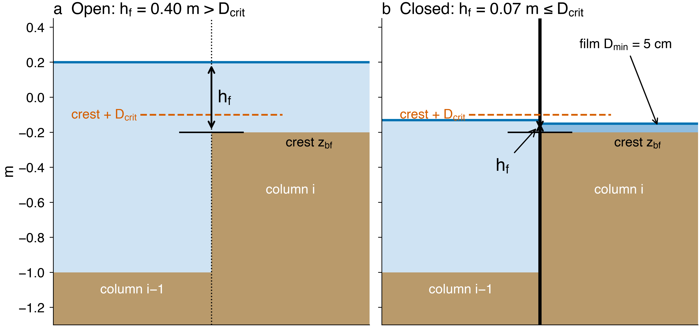
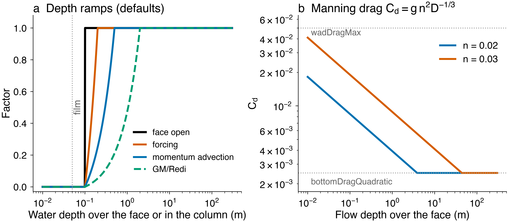
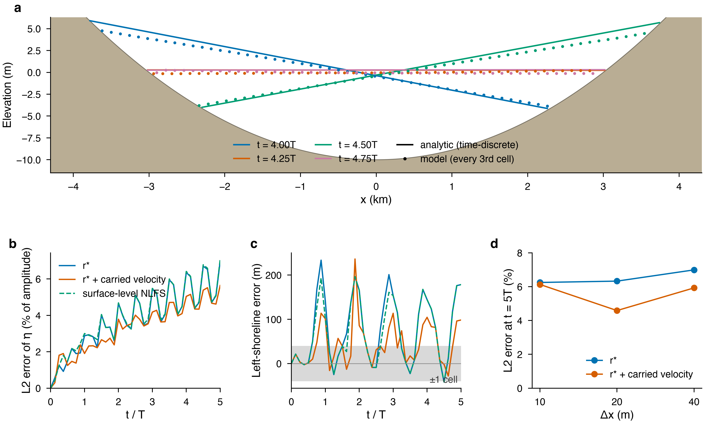
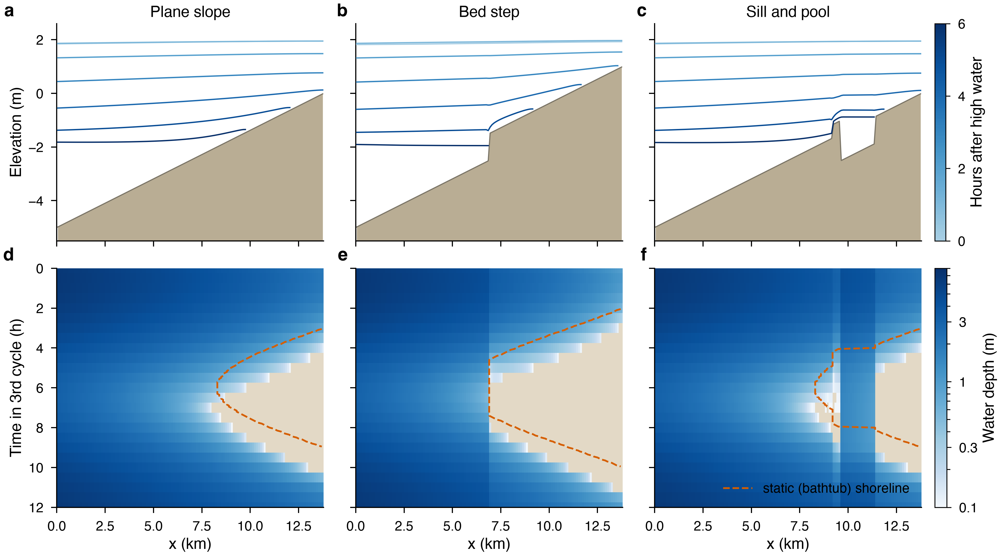

# pkg/wad: formulation

How the wetting-and-drying package works, with the code. Excerpts are
simplified (tile indices `bi,bj` dropped).

## 1. What stock MITgcm does when a column empties

- With r\*, `CALC_R_STAR` stops the run once a column thins below `hFacInf`.
- With the surface-level non-linear free surface, the surface is clipped at
  `Rmin_surf` and the added volume only counted.
- Setting `maskW = 0` alone does not close a face: the CG2D matrix, its
  right-hand side, continuity and tracer transports use `hFacW`, not
  `maskW`.

So pkg/wad keeps a film in every column, closes faces in both `hFacW` and
`maskW`, and bypasses the STOP:

```fortran
C     model/src/calc_r_star.F
      IF ( icntc1+icnts+icntw .GT. 0 .AND. .NOT.useWAD ) THEN
       ...  STOP 'ABNORMAL END: S/R CALC_R_STAR'
```

`nonlinFreeSurf >= 3` is required so that CG2D is rebuilt every step from
the current face thicknesses.

## 2. Definitions

- Water depth `D = etaH + Ro_surf - R_low`.
- Film: every column keeps `D >= wadMinDepth` (5 cm); dry columns stay in
  the grid (`maskC = 1`).
- A face is open when the water over its crest exceeds `wadCritDepth`
  (10 cm). `wadCritDepth > wadMinDepth` gives hysteresis, so the shoreline
  does not flicker.

## 3. The face rule



The flow depth over a face is the higher of the two surfaces minus the
higher of the two beds (Casulli 2009; Stelling and Duinmeijer 2003):

```fortran
C     wad_update_masks.F, west faces
      zbf = MAX( R_low(i-1,j), R_low(i,j) )
      hf  = MAX( Ro_surf(i-1,j)+etaH(i-1,j),
     &           Ro_surf(i,j)  +etaH(i,j) ) - zbf
      newMask = 0.
      IF ( hf.GT.wadCritDepth ) newMask = 1.
      wadMaskW(i,j) = newMask
```

Wetting needs no special case: a face opens as soon as the neighbour's
surface rises `wadCritDepth` above the crest. A wet cell cannot drain below
the crest + `wadCritDepth` through that face.

## 4. Closing a face in the geometry

```fortran
C     wad_update_masks.F: velocity mask
      maskW(i,j,k) = wadMaskW0(i,j,k)*wadMaskW(i,j)
C     model/src/update_r_star.F: face thickness
      IF ( useWAD ) hFacW(i,j,k) = hFacW(i,j,k)*wadMaskW(i,j)
```

The Adams-Bashforth momentum history is zeroed on closed faces. The mask
is applied before `UPDATE_R_STAR`, so continuity at step n and tracer
advection see the same `hFacW`: a uniform tracer stays uniform.

## 5. Where pkg/wad sits in the time step

```
 FORWARD_STEP
   DYNAMICS               u*, v*
>> WAD_UPDATE_MASKS       face masks from etaH(n); advection ramp
   UPDATE_R_STAR          hFacW/S *= wadMaskW/S
   UPDATE_CG2D, SOLVE_FOR_PRESSURE
   MOMENTUM_CORRECTION    u(n+1) = u* - dt g grad(eta), 0 on closed faces
>> WAD_LIMIT_OUTFLOW      Froude cap, positivity limiter
>> WAD_CHECK_SPEED        stop on NaN or |u| > wadMaxSpeed
   INTEGR_CONTINUITY      etaH(n+1)
>> WAD_APPLY_FLOOR        backstop clip, budget, %WAD_MON
   CALC_R_STAR            no STOP when useWAD
```

Explicit mask, implicit surface: the splitting of Casulli and Cheng (1992).

## 6. Thickness of an open face

Stock r\* builds the face thickness from the mean of the two surfaces (the
surface-level NLFS from the lower). Next to a bed step that can be zero or
negative on an open face. With `wadUpwindFace` the upwind surface is used,
and every open face keeps at least the film:

```fortran
      IF ( wadUpW(i,j).GT.0. ) THEN
        rStarFacW(i,j) = 1. + etaH(i-1,j)/( rSurfW(i,j) - rLowW(i,j) )
      ELSEIF ( wadUpW(i,j).LT.0. ) THEN
        rStarFacW(i,j) = 1. + etaH(i,j)/( rSurfW(i,j) - rLowW(i,j) )
      ENDIF
      rStarFacW(i,j) = MAX( rStarFacW(i,j),
     &                 wadMinDepth/( rSurfW(i,j) - rLowW(i,j) ) )
```

Thacker error at 5 periods: surface-level NLFS 12.0 → 7.1 %, r\* 7.3 → 7.0 %.

## 7. Outflow (positivity) limiter

Per column, the volume leaving in one step is compared with the water above
the film; every outgoing face is scaled by `f = min(1, available /
outgoing)`. Each face is outgoing for one column only, so it is scaled at
most once, and `D(n+1) >= wadMinDepth` holds exactly. Continuity and the
tracer transports use the limited velocity, so volume and tracers stay
conserved. It acts as a local implicit drag.

```fortran
      DO k=1,Nr
       trW = -uVel(i,j,k)  *dyG(i,j)  *drF(k)*hFacW(i,j,k)
       trE =  uVel(i+1,j,k)*dyG(i+1,j)*drF(k)*hFacW(i+1,j,k)
       outVol = outVol + MAX(trW,0.) + MAX(trE,0.) + ...
      ENDDO
      avail = MAX( 0., colD - wadMinDepth )*rA(i,j)
      IF ( outVol*deltaTFreeSurf.GT.avail )
     &   wadOutFac(i,j) = avail/(outVol*deltaTFreeSurf)
C     scale by the factor of the upstream column
      IF ( uVel(i,j,k).GT.0. ) THEN
       uVel(i,j,k) = uVel(i,j,k)*wadOutFac(i-1,j)
      ELSE
       uVel(i,j,k) = uVel(i,j,k)*wadOutFac(i,j)
      ENDIF
```

With `useRealFreshWaterFlux`, evaporation is limited the same way, and on
dry columns ramped off (the removed part is the `WADEVLIM` diagnostic).

## 8. Film floor and volume budget

After continuity, any column below the film is raised to it; the added
water is taken from open-face neighbours (up to their depth above
`wadCritDepth`), the rest logged. With the limiter this almost never
triggers (~1e-9 m³ in Thacker). The budget, vol − vol0 − inflow − floor
adjustment, is printed every `wadMonFreq`; inflow counts open boundaries,
`addMass` and the real fresh-water flux. It is ~1e-15 of the volume in all
tests.

## 9. Momentum in thin water

- Vector-invariant momentum with `upwindShear` (flux form blows up at the
  drying front).
- Momentum advection ramped off between `wadCritDepth` and `wadAdvDepth`
  (as in ROMS); pressure gradient, Coriolis and drag untouched:

```fortran
C     pkg/mom_vecinv/mom_vecinv.F; wadGu = gU before the advection terms
      gU(i,j,k) = wadGu(i,j) + wadAdvFacW(i,j)*( gU(i,j,k) - wadGu(i,j) )
```

- Optional Froude cap `|u| <= wadMaxFroude*sqrt(g D)` for sheets pouring
  off banks; optional carry of the upstream depth-mean u\* onto opened
  faces (`wadCarryVel`).

## 10. Bottom drag

Explicit quadratic drag is unstable when Cd |u| Δt / h > 2, which
r\*-thinned bottom cells reach: use `selectImplicitDrag=2`. Optional Manning
drag from the flow depth over each face, every step:



```fortran
C     wad_botdrag.F
      hf = MAX( hf, wadMinDepth )
      cd = gravity*rn*rn*hf**(-1./3.)
      bottomDragCoeffW(i,j) = MIN( wadDragMax, MAX( bottomDragQuadratic, cd ) )
```

## 11. Tapers on shallow columns

- Surface heat, salt, short-wave and pTracer forcing off on dry columns:
  factor `fD` from 0 at `wadCritDepth` to 1 at `2 wadCritDepth`.
- KPP non-local flux capped at the surface flux in columns shallower than
  `wadKPPCapDepth`.
- GM/Redi tensor ramped off below `wadGMDepth`.

```fortran
C     wad_dry_forcing.F
      fD = MIN( 1., MAX( 0., ( etaH + Ro_surf - R_low - wadCritDepth )
     &                       /wadCritDepth ) )
      surfaceForcingT = surfaceForcingT*fD
      surfaceForcingS = surfaceForcingS*fD
      Qsw = wadQswIn*fD
```

## 12. Verification



Thacker basin (Thacker 1981): volume and salt exact; surface error at 5
periods ~7 % of the initial amplitude, set by the film and the face
threshold rather than the grid size.



Balzano (1998) slope, step and pool: budget error ≤ 3.5e-15; the pool
bottoms out at the sill crest + 0.100 m, as the face rule prescribes.

## 13. Ripples, time step and cost

- Opening and closing faces give step-to-step ripples within 2–3 cells of
  the shoreline (up to ~0.3 m in the frictionless Thacker test, halved with
  bottom drag), under 1 mm in the interior, and smooth basin waves of
  ~±0.2 m (3 % of the swing) that bottom drag damps.
- The package itself does not lower the stable time step (10 s with WAD off
  and on in a 100 m estuary where nothing dries); drying flats can (6 s,
  limited at a 6 m bed step).
- Cost: ~9 % per step (limiter 3 %, masks 2 %); the pressure solver is
  unchanged.
